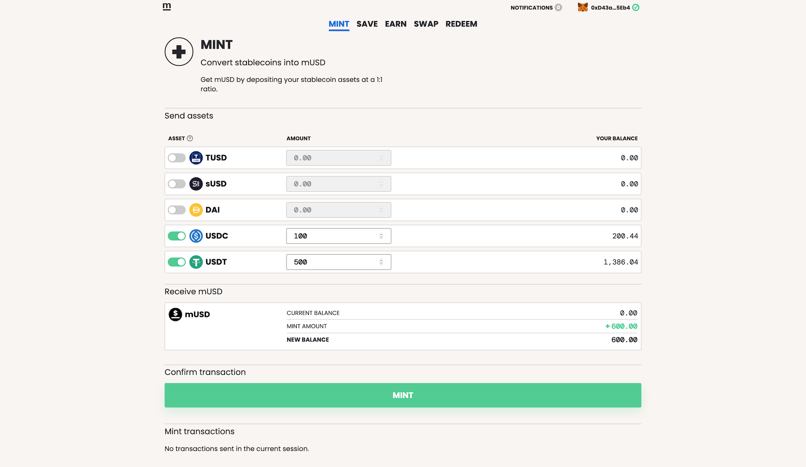

# Brand Assets

## About mStable

mStable is a protocol for autonomous and non-custodial stablecoin infrastructure.

## Logo Kits





### mStable

**mStable logo**: to be used when referencing mStable the platform and protocol

**Meta logo**: to be used when referencing the Meta \(MTA\) token on websites and UIs

### mUSD

**mUSD logo**: to be used when referencing the mUSD stable coin on websites and UIs

## Colours

Tangerine yellow \(\#FAB41F\), navy blue \(\#0061E3\), Smokey white \(\#F8F5F2\), and black \(\#000000\) are mStable's primary brand colours.

### Please Do

* Use all caps MTA when discussing trading pairs \(ETH/MTA\) and displaying amounts \(14.75 MTA\).
* Use a lowercase `m` on mUSD when discussing trading pairs \(ETH/mUSD\) and displaying amounts \(1,000 mUSD\).

### Please Do Not

* Alter the logos or icons in any way.

### Products



### Contact

For more information or assistance, send an email with your request to [derek@mstable.org](mailto:derek@mstable.org).

