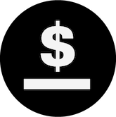
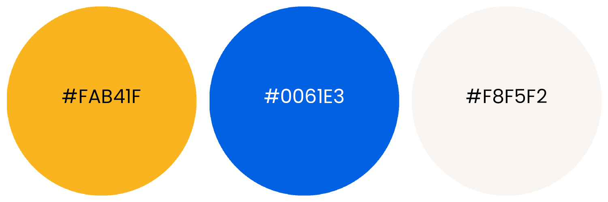

# Brand Assets

## About mStable

mStable is a protocol that unites stablecoins, lending and swapping into one standard. By reducing complexity and fragmentation, mStable is a step-change in the usability of stablecoins.

## Logo Kits





### mStable

**mStable logo**: to be used when referencing mStable the company

**Meta logo**: to be used when referencing the Meta \(MTA\) token on websites and UIs

### mUSD

**mUSD logo**: to be used when referencing the mUSD stable coin on websites and UIs

## Colours

Tangerine yellow \(\#FAB41F\), navy blue \(\#0061E3\), Smokey white \(\#F8F5F2\), and black \(\#000000\) are mStable's primary brand colours.

### Please Do

* Use all caps MTA when discussing trading pairs \(ETH/MTA\) and displaying amounts \(14.75 MTA\).
* Use a lowercase m on mUSD when discussing trading pairs \(ETH/mUSD\) and displaying amounts \(1,000 mUSD\).

### Please Do Not

* Alter the logos or icons in any way.

