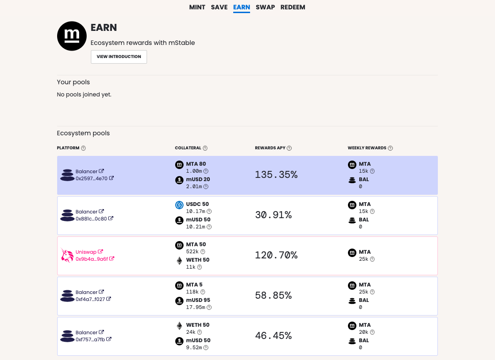

# EARN

## One Place for MTA rewards

It’s a dashboard through which our users can see all of their yield farming on mStable in one convenient interface.

rewards will now be continuous, accumulating in real time in line with the duration of liquidity contributions.

We’ll be seeking feedback from the community on these pools in the coming days and weeks, and have already had some insightful feedback on what we could possible change to better suit our community’s interests.

To earn rewards, you must contribute liquidity pool tokens to the mStable EARN contracts. Contributing to the underlying liquidity pools and not the EARN contracts will result in missed rewards.

## Platforms 

Balancer, Uniswap. Governance to decide in future 

### Impermanent Loss

pool contains volatile tokens which means it may suffer from impermanent losses - you can learn more about this [here](https://medium.com/dragonfly-research/what-explains-the-rise-of-amms-7d008af1c399) and [here](https://cryptobriefing.com/how-to-yield-farm-uniswap-not-get-rekt/)

