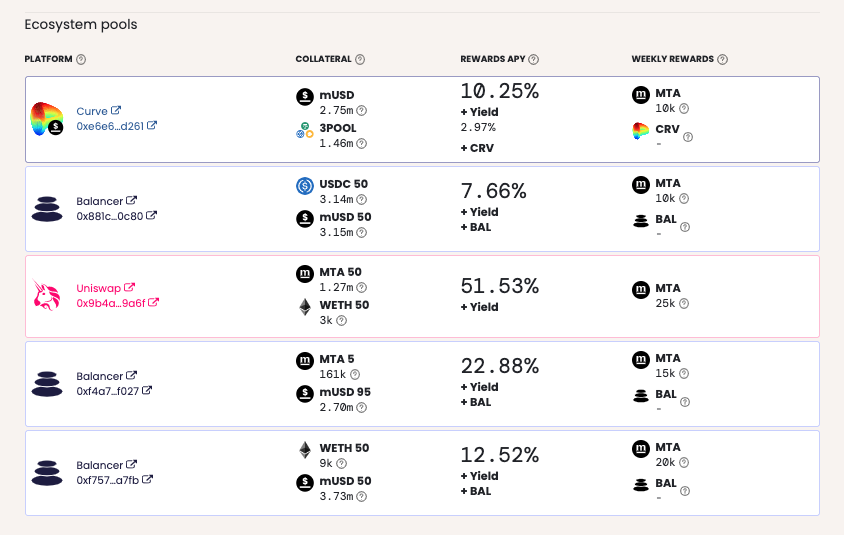

# Earn

EARN is the place where a portion of mStable's Public `MTA` are currently distributed. The other place is the "Deposit Box" in SAVE. It is primarily built as a way to distribute Meta tokens and decentralise the governance community of the mStable protocol, while at the same time contributing to the utility of the protocol.

### **Earning MTA**

To earn `MTA` rewards, users must contribute liquidity pool tokens from the relevant pool to the mStable EARN contracts.

Currently, EARN lists incentivised liquidity pools from [Balancer](https://balancer.finance/), [Curve](https://www.curve.fi/), and [Uniswap](https://uniswap.io/). These pools are changed in response to votes by Meta Governors.

### Impermanent Loss

Finally, it is important to state that participation in these liquidity pools can expose you to _impermanent loss_. In particular, pools containing volatile tokens as one or both sides of the pool are very susceptible to impermanent loss as the price of the volatile token changes. Please do your own due diligence on impermanent loss before choosing to use EARN. You can learn more about it [here](https://medium.com/dragonfly-research/what-explains-the-rise-of-amms-7d008af1c399) and [here](https://cryptobriefing.com/how-to-yield-farm-uniswap-not-get-rekt/).

